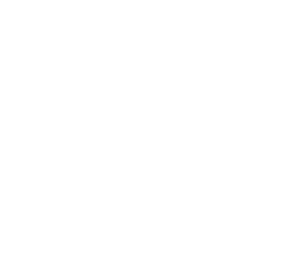

&line_height=20&title_color=deab3c&icon_color=d5e61c&text_color=619c36&bg_color=00000000)

> Switch to [Dark mode](https://github.com/settings/appearance) for better experience 😊

### Find me on social networks
     

### Tools and technologies
          

### Now listening to 🎧

